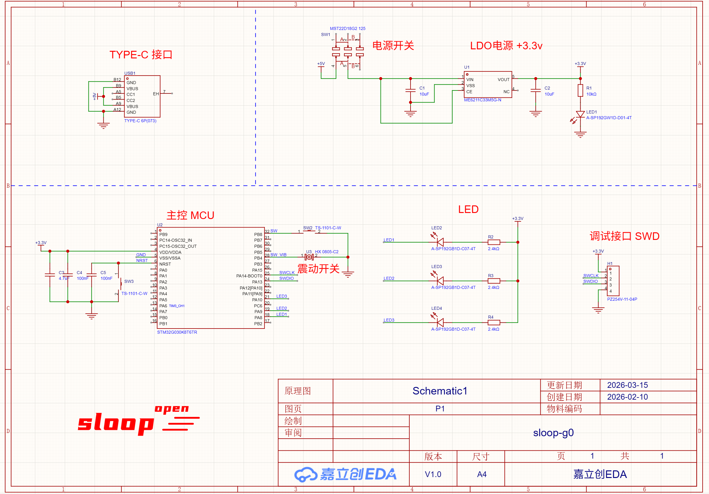

# sloop 演示板 LED Demo

## 项目简介

这是一个基于 sloop 框架的 STM32G030K8T6 演示板 LED 控制示例。本项目展示了如何使用 sloop 框架和 flow 工作流机制来实现 LED 的控制和交互。

## 硬件规格

### 核心芯片
- **主控**：STM32G030K8T6
- **内存**：8KB RAM
- **Flash**：64KB Flash

### 板载资源
- **用户输入**：1个用户按键、1个振动开关
- **用户输出**：3个用户LED
- **系统控制**：1个复位按钮
- **状态指示**：1个电源指示灯
- **调试接口**：SWD调试接口
- **供电方式**：Type-C接口供电

### 硬件资源预览

#### 3D视图


#### 原理图



## 软件架构

### sloop 框架简介

sloop 是一个轻量级的嵌入式任务调度框架，采用单线程协作式调度模型。它通过"互斥主任务 + 并行回调 + 软件定时器"构建执行模型，提供了丰富的任务管理功能，同时保持极低的资源消耗。

### flow 工作流机制

flow 是基于 sloop 框架的协作式工作流编程机制，通过宏定义构建可挂起的执行体，实现类似协程的断点续执行能力。它采用线性代码结构，使复杂业务逻辑更加清晰易读。

## LED Demo 功能

本示例展示了如何使用 sloop 框架和 flow 工作流机制来控制板载 LED，实现以下功能：

- **LED 流星灯效果**：主要演示功能
- **按键**：作为用户拓展接口
- **振动开关**：作为用户拓展接口
- **通过 RTT 输出运行日志**

### 运行效果

#### LED Demo 运行视频

<video width="400" controls>
  <source src="https://github.com/sloop-open/sloop_g0_board/blob/main/resource/led.mp4" type="video/mp4">
  你的浏览器不支持 HTML5 视频。
</video>

#### RTT 运行日志


## 项目结构

```
├── project/             # 项目文件
│   ├── Core/            # 核心系统文件
│   ├── Drivers/         # STM32 HAL和CMSIS库
│   ├── MDK-ARM/         # Keil项目文件
│   └── user/            # 用户应用代码
│       ├── app/         # 应用层
│       │   ├── config/  # 配置文件
│       │   └── tasks/   # 任务实现
│       └── sloop/       # 框架核心
│           ├── RTT/     # SEGGER RTT库
│           └── kernel/  # 内核实现
├── resource/            # 资源文件
│   ├── 3d view.png      # 板子3D视图
│   ├── Schematic.png    # 原理图
│   ├── led demo.mp4     # LED Demo运行视频
│   └── rtt log.png      # RTT运行日志
├── LICENSE              # 许可证文件
└── README.md            # 项目文档
```

## 快速开始

### 环境搭建
1. 安装 Keil MDK-ARM 5.x+
2. 安装 STM32G0 系列支持包
3. 克隆或下载本项目
4. 使用 Keil MDK 打开 `project/MDK-ARM/project.uvprojx`

### 项目编译
1. 选择目标设备（STM32G030K8Tx）
2. 配置编译选项
3. 点击编译按钮（F7）
4. 生成的固件位于 `project/MDK-ARM/bin/project.hex`

### 烧录与运行
1. 使用 SWD 调试器连接开发板
2. 烧录编译生成的固件
3. 观察 LED 运行效果
4. 使用 J-Link RTT Viewer 查看运行日志

## 核心功能实现

### LED 控制任务

LED 控制任务负责管理板载 LED 的状态，实现闪烁效果和状态变化。


### 工作流示例

展示如何使用 flow 工作流机制实现复杂的 LED 控制逻辑，包括状态管理和事件处理。

## 技术特点

- **轻量级**：sloop 框架资源消耗低，适合资源受限的微控制器
- **易用性**：简洁直观的 API 设计，支持协作式工作流编程
- **可扩展性**：模块化设计，便于功能扩展
- **实时性**：高效的任务调度算法，保证实时响应

## 许可证

本项目采用 MIT 许可证，详见 LICENSE 文件。

## 联系方式

如有问题或建议，欢迎提交 Issue 或 Pull Request。

---

# sloop Demo Board LED Demo

## Project Introduction

This is an LED control example based on the sloop framework for the STM32G030K8T6 demo board. This project demonstrates how to use the sloop framework and flow workflow mechanism to implement LED control and interaction.

## Hardware Specifications

### Core Chip
- **Main Control**: STM32G030K8T6
- **RAM**: 8KB RAM
- **Flash**: 64KB Flash

### On-board Resources
- **User Input**: 1 user button, 1 vibration switch
- **User Output**: 3 user LEDs
- **System Control**: 1 reset button
- **Status Indication**: 1 power indicator
- **Debug Interface**: SWD debug interface
- **Power Supply**: Type-C interface

### Hardware Resources Preview

#### 3D View


#### Schematic


## Software Architecture

### sloop Framework Introduction

sloop is a lightweight embedded task scheduling framework that adopts a single-threaded cooperative scheduling model. It builds an execution model through "mutex main task + parallel callback + software timer", providing rich task management functions while maintaining extremely low resource consumption.

### flow Workflow Mechanism

flow is a cooperative workflow programming mechanism based on the sloop framework. It builds suspendable execution units through macro definitions, achieving coroutine-like breakpoint continuation capabilities. It adopts a linear code structure, making complex business logic clearer and easier to read.

## LED Demo Features

This example demonstrates how to use the sloop framework and flow workflow mechanism to control on-board LEDs, implementing the following features:

- **LED Meteor Light Effect**: Main demonstration feature
- **Button**: As user expansion interface
- **Vibration Switch**: As user expansion interface
- **RTT Log Output**

### Running Effects

#### LED Demo Running Video

[LED Demo Running Video](resource/led%20demo.mp4)

#### RTT Running Log


## Project Structure

```
├── project/             # Project files
│   ├── Core/            # Core system files
│   ├── Drivers/         # STM32 HAL and CMSIS libraries
│   ├── MDK-ARM/         # Keil project files
│   └── user/            # User application code
│       ├── app/         # Application layer
│       │   ├── config/  # Configuration files
│       │   └── tasks/   # Task implementations
│       └── sloop/       # Framework core
│           ├── RTT/     # SEGGER RTT library
│           └── kernel/  # Kernel implementation
├── resource/            # Resource files
│   ├── 3d view.png      # Board 3D view
│   ├── Schematic.png    # Schematic
│   ├── led demo.mp4     # LED Demo running video
│   └── rtt log.png      # RTT running log
├── LICENSE              # License file
└── README.md            # Project documentation
```

## Quick Start

### Environment Setup
1. Install Keil MDK-ARM 5.x+
2. Install STM32G0 series support package
3. Clone or download this project
4. Open `project/MDK-ARM/project.uvprojx` using Keil MDK

### Project Compilation
1. Select the target device (STM32G030K8Tx)
2. Configure compilation options
3. Click the compile button (F7)
4. The generated firmware is located at `project/MDK-ARM/bin/project.hex`

### Flashing and Running
1. Connect the development board using SWD debugger
2. Flash the compiled firmware
3. Observe the LED running effects
4. Use J-Link RTT Viewer to view running logs

## Core Function Implementation

### LED Control Task

The LED control task is responsible for managing the state of on-board LEDs, implementing meteor light effects and state changes.

### Button Handling

Detect state changes of user buttons and vibration switches through interrupts, and trigger corresponding LED control logic.

### Workflow Example

Demonstrate how to use the flow workflow mechanism to implement complex LED control logic, including state management and event handling.

## Technical Features

- **Lightweight**: sloop framework has low resource consumption, suitable for resource-constrained microcontrollers
- **Ease of Use**: Simple and intuitive API design, supporting cooperative workflow programming
- **Extensibility**: Modular design for easy function expansion
- **Real-time Performance**: Efficient task scheduling algorithm to ensure real-time response

## License

This project adopts the MIT license, please refer to the LICENSE file for details.

## Contact

If you have any questions or suggestions, please feel free to submit Issues or Pull Requests.